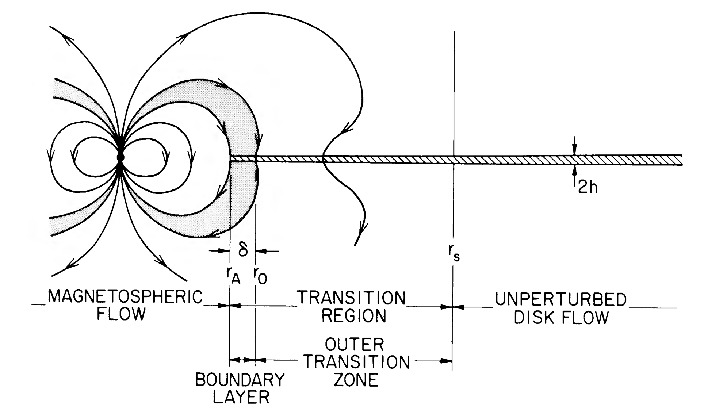

# Accretion in high energy astrophysics

Accretion is an important source of energy in high energy astrophysics because as we will see it allows for efficient conversion of gravitational energy to luminosity. We will first discuss the efficiency of accretion and then talk about three modes of accretion: Bondi accretion from the interstellar medium, thin disks, and magnetized accretion. 

## The efficiency of accretion

Consider accretion of gas onto a star of mass $M$ and radius $R$. The infalling gas will reach the surface of the star with kinetic energy per unit mass $v^2\sim GM/R$. Assuming this energy is radiated away gives an accretion luminosity 

$$
L_\mathrm{accr} = {GM\over R}\dot M
$$

where $\dot M$ is the accretion rate.

```{note}
You'll see accretion rates given as both $\mathrm{g\ s^{-1}}$ and $M_\odot\ \mathrm{yr^{-1}}$. A useful conversion between these is $10^{18}\ \mathrm{g\ s^{-1}}\approx 10^{-8}\ M_\odot\ \mathrm{yr}^{-1}$. This also happens to be the accretion rate which gives an accretion luminosity of $\sim L_\mathrm{Edd}\sim 10^{38}\ \mathrm{erg\ s^{-1}}$ for a $\sim 1\ M_\odot$ star.
```

It is useful to define an accretion efficiency $\eta$ such that 

$$
L_\mathrm{accr}= \eta \dot M c^2.
$$

For the case where all of the accretion energy goes into radiation, we have $\eta\approx GM/Rc^2 = R_S/2R$ where $R_S=2GM/c^2=3\ \mathrm{km}\ (M/M_\odot)$ is the Schwarzschild radius. 

Compact objects such as neutron stars and black holes can convert a significant amount of gravitational energy into radiation. For a neutron star, we have 

$$
\eta\approx {GM\over Rc^2} = 0.148\ \left({M\over M_\odot}\right)\left({R\over 10\ {\rm km}}\right)^{-1}
$$

which shows that the accretion energy is a significant fraction of the rest mass energy,

$$
{GMm_p\over R}\approx 140\ \mathrm{MeV}\ \left({M\over M_\odot}\right)\left({R\over 10\ {\rm km}}\right)^{-1}
$$

compared to the proton rest mass $m_pc^2\sim \mathrm{GeV}$. For a white dwarf, with a radius $\sim 1000$~times larger than a neutron star, the gravitational energy is of order $\sim 100\ \mathrm{keV}$ per proton. We can compare these numbers with the efficiency of nuclear burning: hydrogen burning to helium gives $\approx 7$ MeV per nucleon, corresponding to $\eta\approx 0.007$.

Black holes are more complicated because they do not have a solid surface. If the gravitational energy is efficiently converted to radiation in the accretion flow, efficiencies comparable to the neutron star value are possible. For a Schwarzschild black hole, the energy of the innermost stable orbit (ISCO) at $6GM/c^2=3R_S$ gives $\eta=0.057$. For a maximally-rotating black hole, the innermost stable orbit moves inwards giving $\eta\approx 0.42$. However, if the accretion flow does not radiate efficiently, the accretion energy could be carried across the event horizon, corresponding to a much smaller $\eta$. A key question is how well the electrons and protons are coupled, since the protons carry the gravitational energy but the electrons radiate. 

We observe both efficient and inefficient accretion. For example, in AGN, accretion occurs in a disk on a timescale set by viscous processes, which gives plenty of time for protons to share their energy with the electrons. The luminosity is 

$$
L\approx 10^{47}\ \mathrm{erg\ s^{-1}}\ \left({\eta\over 0.1}\right)\left({\dot M\over 10\ M_\odot\ \mathrm{yr}^{-1}}\right).\hspace{2cm}(*)
$$

The black hole at the Galactic centre on the other hand, Sgr A$^\star$ has a very low efficiency. Based on conditions near the black hole, the accretion rate is estimated to be $\sim 10^{-15}\ M_\odot\ \mathrm{yr}^{-1}$ but the luminosity is only $\approx 3\times 10^{33}\ \mathrm{erg\ s^{-1}}$, corresponding to $\eta\approx 3\times 10^{-9}$ (e.g. see [Baganoff et al. 2001](https://ui.adsabs.harvard.edu/abs/2001Natur.413...45B/abstract)). The flow in this case is spherical with rapid infall. There is little time for heating the electrons or radiating; in this case a "two-temperature plasma" develops in which the electron and proton temperatures can be very different.

## Bondi accretion

The simplest geometry for an accretion flow is to consider spherically-symmetric accretion of gas onto a point mass. This is known as Bondi accretion. 

To see the scalings, it is simpler first to think about the flow of gas onto a star moving with velocity $v$ through a uniform medium (e.g.~the interstellar medium). The star will sweep up mass at a rate 

$$
\dot M\sim \pi b^2 \rho v,
$$

where $\rho$ is the gas density, and $b$ is the capture radius given roughly by

$$
v^2\sim {GM\over b}.
$$

Depending on the velocity, the effective size of the star can be orders of magnitude larger than its physical size: 

$$
b\sim 2000\ R_\odot\ \left({M\over M_\odot}\right)\left({v\over 10\ \mathrm{km\ s^{-1}}}\right)^{-2}.
$$

The accretion rate is 

$$
\dot M\sim {\pi \rho (GM)^2\over v^3}\approx 10^{11}\ \mathrm{g\ s^{-1}}\ \left({M\over M_\odot}\right)^2\left({n\over \mathrm{cm^{-3}}}\right)\left({10\ \mathrm{km}\over v}\right)^3,
$$

where the density is scaled to a typical mean interstellar medium density $\sim 1\ \mathrm{cm^{-3}}$. This is a small accretion rate -- $10^{11}\ {\rm g\ s^{-1}}$ corresponds to $\approx 10^{-15}\ M_\odot\ \mathrm{yr}^{-1}$, so the mass added to the star is negligible and equation (*) gives a low luminosity $\sim 10^{31}\ {\rm erg\ s^{-1}}$ (about $10^7$ times smaller than the Eddington luminosity).

The same scalings apply to spherical accretion from a uniform medium, but with the velocity $v$ replaced by the sound speed $c_s$. The capture radius is then given by the *Bondi radius* $R_B=GM/2c_s^2$. The sound speed is 

$$
c_s\approx \left({k_BT\over m_p}\right)^{1/2}=9\ \mathrm{km\ s^{-1}}\ \left({T\over 10^4\ \mathrm{K}}\right)^{1/2}
$$

giving 

$$
R_B = {GM\over 2c_s^2}\approx 1150\, R_\odot\ \left({M\over M_\odot}\right)\left({T\over 10^4\ \mathrm{K}}\right)^{-1}
$$

and

$$
\dot M\sim 10^{11}\ \mathrm{g\ s^{-1}}\ \left({M\over M_\odot}\right)^2\left({n\over \mathrm{cm^{-3}}}\right)\left({T\over 10^4\ \mathrm{K}}\right)^{-3/2}.
$$

As an example, the hot gas near Sgr A$^\star$ has $T\approx 2\times 10^7\ {\rm K}$ and $n\sim 100\ {\rm cm^{-3}}$ (e.g. see [Quataert et al. 1999](https://ui.adsabs.harvard.edu/abs/1999ApJ...517L.101Q/abstract) and [Baganoff et al. 2001](https://ui.adsabs.harvard.edu/abs/2001Natur.413...45B/abstract). With $M=2.4\times 10^6\ M_\odot$, this gives $\dot M\sim 10^{21}\ {\rm g\ s^{-1}}\sim 10^{-5}\ M_\odot\ \mathrm{yr}^{-1}$.

## Thin accretion disk

Often the incoming gas has too much angular momentum to accrete straight onto the star. The accreting gas settles into a rotating flow in which viscous processes act to transport angular momentum outwards, allowing the gas to accrete.

The classic example is the **thin disk** that forms when gas is able to cool efficiently, ie.~it can lose energy much faster than angular momentum. The accreting gas then settles into a disk surrounding the central object. Viscosity acts to spin up the outer part of the disk relative to the inner part, removing angular momentum from the inner part, which falls inwards and releases gravitational energy.

The detailed equations that describe the evolution of a thin disk can be found in the review by [Pringle 1977](https://ui.adsabs.harvard.edu/abs/1981ARA%26A..19..137P/abstract). Here we'll focus on the main physical ideas and derive the main results at the back of the envelope level:

*  **Keplerian orbits**. The main assumption is that particles in the disk are on Keplerian orbits 

$$
\Omega^2 = {GM\over r^3}
$$

which means that the velocity decreases outwards. Viscosity tries to reduce the differential rotation which then transports angular momentum outwards.
*  **Vertical structure**. For small disk masses, the gravity from the central star dominates. The vertical component is 

$$
g_z = {GM\over r^2}{z\over r}
$$

where $r$ is the midplane distance from the central star, and $z$ is the vertical distance from the midplane (i.e.~cylindrical coordinates). Hydrostatic balance in the vertical direction $\partial P/\partial z=\rho g_z$ then implies that the midplane pressure is

$$
P\approx {GM\over r^2}{H\over r}\Sigma = {GM\over r^3} H^2 \langle\rho\rangle,
$$ 
where $H$ is the characteristic disk thickness, $\Sigma$ is the column density (mass per unit area) in the disk, and the mean density is $\langle\rho\rangle\approx \Sigma/H$. Since the sound speed is given by $c_s^2\approx P/\langle\rho\rangle$, we have the result 

$$
\boxed{c_s = \Omega H}.
$$

This result encapsulates the vertical hydrostatic balance. It implies that 

$$
{c_s\over v_{\rm Kep}} = {c_s\over \Omega r} = {H\over r}< 1
$$

(the disk is thin), showing that the Keplerian motion is supersonic.
*  **Surface temperature**. If the disk radiates as a blackbody and is accreting steadily, then we could write an equation for energy conservation at a radius $r$ as

$$
2\times \sigma_{SB}T_\mathrm{eff}^4 \times 2\pi r dr = {GM\dot M\over 2r^2} dr,\hspace{2cm}(**)
$$

where the factor of 2 on the LHS comes from the two sides of the disk, and the RHS is the rate of release of gravitational energy as mass moves from radius $r+dr$ to $r$ --- recall that the energy of a Keplerian orbit (gravitational plus kinetic) is $-GM/2r$ per unit mass.

In fact, there is also energy released in the form of viscous dissipation in the disk, which turns out to be twice as large as the energy from the changing orbit, giving a factor of 3 on the RHS. Inserting the correct prefactor, we get the temperature profile of the disk 

$$
\boxed{T_\mathrm{eff} = \left({3GM\dot M\over 8\pi r^3 \sigma_{SB}}\right)^{1/4}\propto {1\over r^{3/4}}}
$$

```{note}
The viscous heating rate per unit volume is $\Sigma\nu(dv_\mathrm{Kep}/dr)^2\sim \Sigma \nu \Omega^2$. In the innermost part of the disk, the profile deviates from Keplerian and the dissipation is actually smaller than the RHS of equation (**), as needed so that overall energy is released in the disk at a rate $GM\dot M/2R$.
```

*  **Viscous time**. In the fluid momentum equation, the viscous term looks like $\nu \nabla^2\vec{u}$, so that the characteristic viscous timescale is given by 

$$
t_\mathrm{visc}\approx {r^2\over \nu}
$$

(the velocity varies on a lengthscale $\sim r$). 

The source of viscosity in disks was a puzzle for a long time! Microscopic viscosity is much too small to reproduce observed accretion rates in disks. Shakura and Sunyaev introduced the famous $\alpha$-prescription for viscosity, writing 

$$
\nu \equiv \alpha c_s H
$$

where the viscosity is written in terms of the sound speed and disk thickness. Since these set the maximal scales for velocity and length in the disk, we expect to have $\alpha<1$. 

The viscous time is therefore 

$$
\boxed{t_\mathrm{visc}\approx {r^2\over \nu} = {r^2\over \alpha c_s H} = \alpha^{-1} \Omega^{-1} \left({r\over H}\right)^2,}
$$

much greater than the orbital timescale $\Omega^{-1}$.

The radial flow speed is 

$$
\boxed{v_r\approx {r\over t_\mathrm{visc}} \approx \alpha c_s \left({H\over r}\right) \ll c_s.}
$$

We can use this to estimate the accretion rate 

$$
\dot M\approx 2\pi r H \rho v_r \approx 2\pi \Sigma \nu.
$$ 

In fact, the real calculation gives 

$$
{\dot M\over 3\pi}\left[1-\left({R_\star\over r}\right)^{1/2}\right] = \nu \Sigma.
$$

In the outer parts of the disk where $r\gg R_{\star}$, 

$$
\boxed{\dot M \approx 3\pi \nu \Sigma}
$$

```{note}
In the theory, correction terms like the one in square brackets appear in many of the equations -- they are important near the star, where the flow begins to deviate from Keplerian as it joins onto the star. For example, as mentioned in the footnote on the previous page, the local flux near the star is suppressed relative to the outer parts of the disk. For more details see [Pringle (1977)](https://ui.adsabs.harvard.edu/abs/1981ARA\%26A..19..137P/abstract).
```

*  **Shape of the disk**. The sound speed $c_s\propto T^{1/2}$. For an optically-thin disk where the midplane temperature is the same as the surface temperature, then 

$$
c_s\propto T^{1/2}\propto r^{-3/8}
$$

$$
\Rightarrow {H\over r} \approx {c_s\over \Omega r}\propto r^{1/8}
$$

The disk flares slightly ($H/R$ increases outwards). If the disk is optically-thick in the vertical direction, with optical depth $\tau\gg 1$, then $T^4\approx \tau T^4_\mathrm{eff}$. We then need to use the opacity of the disk material to calculate $\tau$. You'll do this in the numerical exercise this week.


## Accretion onto a magnetized star

The accretion flow near a star which is strongly-magnetized can be disrupted by the magnetic field. The flow is then channelled by the magnetic field onto the magnetic polar caps of the star.

To estimate when this happens, we can compare the magnetic pressure 

$$
{B^2\over 8\pi} = {B_\star^2\over 8\pi}\left({R_\star\over r}\right)^6\propto {1\over r^6}
$$

to the ram pressure in the accretion flow 

$$
\rho v^2\approx {\dot M\over 4\pi r^2 v} v^2 = {\dot M\over 4\pi r^2}\left({2GM\over r}\right)^{1/2}\propto {1\over r^{5/2}}.
$$

Here we take the magnetic field of the star to be a dipole, giving $B=B_\star (R_\star/r)^3$ (higher order multipoles fall off more quickly with $r$, so usually the dipole component is the relevant one). We've also used the relation $\dot M = 4\pi r^2 \rho v$ for a steady accretion flow and taken the velocity to be the free-fall velocity, giving $v^2\sim 2GM/r$. 

This shows that magnetic pressure grows more quickly with decreasing $r$ than the ram pressure. At a distance $r < r_M$, the flow becomes magnetically-channelled, where $r_M$ is the radial distance where magnetic and ram pressures are equal, 

$$
\boxed{r_M = \left(B_\star^2R_\star^6\over 2\dot M(2GM)^{1/2}\right)^{2/7} = 5\times 10^8\ {\rm cm}\ \mu_{30}^{4/7}\dot M_{16}^{-2/7}\left({M\over M_\odot}\right)^{-1/7}}
$$

where $\mu_{30}$ is the dipole moment $B_\star R_\star^3$ in units of $10^{30}\ {\rm G\ cm^3}$, and $\dot M_{16}$ is the accretion rate in units of $10^{16}\ {\rm g\ s^{-1}}$. This value of dipole moment corresponds to a neutron star with a magnetic field of $\sim 10^{12}\ {\rm G}$ or a white dwarf with a magnetic field of $\sim 10^3\ {\rm G}$. 

In fact, we need to balance the magnetic torque with the viscous torque to find $r_M$ for disk accretion, but the answer is about the same (and has the same scalings). For a famous treatment of the disk case, you can look at [Ghosh \& Lamb (1978)](https://ui.adsabs.harvard.edu/abs/1978ApJ...223L..83G/abstract) and their follow up papers. This figure from their paper shows the accretion geometry:



The accretion disk is terminated near $r_M$, and the matter funnelled onto the magnetic polar cap. The size of the polar cap is generally very small. For a rotation-aligned dipole field, $\sin^2\theta/r$ is constant along a magnetic field line, so the polar cap angle is $\approx (R_\star/r_M)^{1/2}$. 

Rotation of the star produces pulsations in the observed emission. There are a few types of observed systems involving accretion onto a neutron star or white dwarf in a close binary. *X-ray pulsars* are accreting neutron stars with $B\sim 10^{12}\ {\rm G}$ and $P_{\rm spin}\sim 0.1$--$1000\ {\rm s}$, while the *accreting millisecond X-ray pulsars* are accreting neutron stars with $B\sim 10^{9}\ {\rm G}$ and $P_{\rm spin}\sim$ few ms. The *AM Her* systems are accreting white dwarfs with $B\sim 10^{7}$--few$\times 10^8\ {\rm G}$ and $P_{\rm spin}\approx P_{\rm orb}$ (the magnetic field is strong enough that no disk forms because $r_M>a$ where $a$ is the orbital separation!). The *intermediate polars* are more weakly-magnetized white dwarfs with $B\sim 10^{5}$--$10^7\ {\rm G}$ and spin periods of tens of seconds to hours. 


## Some things we didn't talk about

Here are some things that we didn't talk about that could be good project ideas. I've included some references that you could use as a starting point (for the older ones take a look at their citations to find more recent papers).

*  **Magneto-rotational instability**. The source of viscosity in disks was a mystery for many years. Models relied on the $\alpha$-prescription that parametrizes the turbulent viscosity. Simulations of magnetized disks show that the magneto-rotational instability (MRI) generates turbulence and transports angular momentum outwards at a fast enough rate to explain observed systems.
Recent paper with a 3D global disk simulation: [Huang et al. (2023)](https://arxiv.org/abs/2301.12679).
*  **Observations of the thin disk spectrum**. The predicted $\nu^{1/3}$ spectrum can be tested observationally using eclipse mapping of disks, e.g. [Baptista (2001)](https://link.springer.com/chapter/10.1007/3-540-45339-3_23).
*  **Thermal instabilities in disks**. In the numerical exercise, you found that the equations that describe the evolution of thin disks have time-dependent solutions. This can be understood as a thermal instability characterized by a S-shaped equilibrium $\Sigma(T)$ curve. [Dubus et al. 2018](https://ui.adsabs.harvard.edu/abs/2018A\%26A...617A..26D/abstract) is an example of an attempt to explain observations of accretion outbursts with the thermal instability model. For a review see [Lasota 2001](https://www.sciencedirect.com/science/article/pii/S1387647301001129?casa_token=P6Wk44j3jN0AAAAA:xP_PqBfMDF-I7uvXhGlSNsqjlIuyMI7L5gCMKikz6UgYFKBka24wdwM98_U2lmHqjF4O65iVBw).
*  **Irradiated disks**. Irradiation of the disk by the central star changes the temperature profile as a function of radius and also changes the shape ($H/r$ profile) of the disk (e.g. [Chiang \& Goldreich 1997](https://ui.adsabs.harvard.edu/abs/1997ApJ...490..368C/abstract)). If the irradiation can maintain high temperatures $\gtrsim 10^4\ {\rm K}$ in the disk then the thermal instability can be quenched, which leads to transient accretion being more likely in black hole systems compared to neutron stars for example (e.g. [King 2001](https://ui.adsabs.harvard.edu/abs/2001ASPC..229..433K/abstract)).
*  **Boundary layers**. The boundary layer is the region where the accretion disk joins the star and the rotation profile has to change from Keplerian $\Omega\propto r^{-3/2}$ to solid body $\Omega\propto r$ at the stellar spin frequency. There are interesting questions about how angular momentum is transported in the boundary as well as how the accreted material spreads over the surface of the star. E.g. [Narayan \& Popham 1993](https://www.nature.com/articles/362820a0), [Belyaev et al. (2013)](https://iopscience.iop.org/article/10.1088/0004-637X/770/1/67/meta).
*  **Geometrically-thick accretion flows**. There are a few different models for the structure of radiatively-inefficient accretion flows, for example the Advection-dominated Accretion Flow or ADAF, and the expected radiation spectrum from such flows. Accreting sources usually show different spectral states that cna be attributed to different accretion geometries at different accretion rates. E.g. [Ball et al. (2001)](https://iopscience.iop.org/article/10.1086/320465/meta), [Esin et al. (1991)](https://iopscience.iop.org/article/10.1086/304829/meta).
*  **Ultra-luminous X-ray sources** (ULXs) --- a relatively new class of source, these are thought to be compact objects accreting at super-Eddington rates, e.g. see [Pinto \& Walton (2023)](https://arxiv.org/abs/2302.00006).


