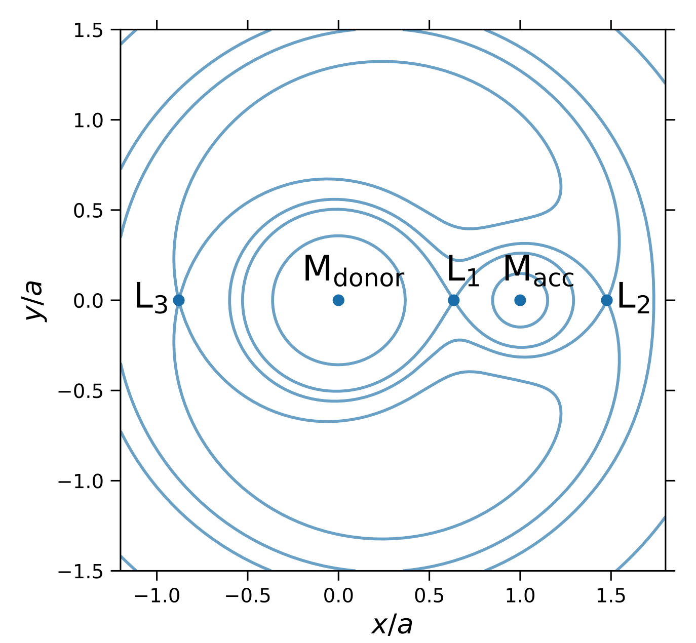

# Binary evolution basics

An important class of accreting systems are compact objects accreting from a companion star in a close binary system. The orbital periods and accretion rates span a wide range of values depending on the type of companion star. Here, we want to cover the important ideas that determine how the binary evolves and what sets the accretion rate onto the compact object.

## Background on the Roche lobe and classical mechanics of binaries

Some important points about binary stars:

* We'll focus on circular orbits since tides usually circularize the orbit very efficiently when mass is being transferred between the two stars. The two stars orbit the center of mass of the system with orbital radii (distance from the star to the center of mass) $a_1$ and $a_2$ given by $M_1a_1=M_2a_2$, where $M_1$ and $M_2$ are the stellar masses.
* We'll refer to the accreting star (the compact object) as the **primary** (star 1) and the mass donor as the **secondary** (star 2). The **mass ratio** 

$$
q={M_2\over M_1}.
$$

* The **orbital period** is related to the separation $a=a_1+a_2$ by 

$$
\Omega_{\rm orb}^2 = \left({2\pi\over P}\right)^2 = {GM_{\rm tot}\over a^3}
$$

where $M_{\rm tot}=M_1+M_2$. To get some sense of the numbers, here are some examples:

$$
a = 1.5\times 10^{13}\ {\rm cm}\ P_\mathrm{yr}^{2/3}\ \left({M_1\over M_\odot}\right)^{1/3}(1+q)^{1/3}\hspace{1.5cm}(1\,{\rm AU})
$$
$$
a = 2.9\times 10^{11}\ {\rm cm}\ P_\mathrm{day}^{2/3}\ \left({M_1\over M_\odot}\right)^{1/3}(1+q)^{1/3}\hspace{1.5cm}(4\,R_\odot)
$$
$$
a = 3.5\times 10^{10}\ {\rm cm}\ P_\mathrm{hr}^{2/3}\ \left({M_1\over M_\odot}\right)^{1/3}(1+q)^{1/3}\hspace{1.5cm}(0.5\,R_\odot)
$$
where we've written the scalings in terms of the primary mass $M_1$ and the mass ratio $q$.

* The total **angular momentum in the orbit** is 

$$
J = (M_1a_1^2+M_2a_2^2)\Omega = {a^2\Omega\over M_\mathrm{tot}^2}(M_1M_2^2 + M_2M_1^2) = {M_1M_2\over M_\mathrm{tot}} \sqrt{{GM_\mathrm{tot}a}}.
$$

* A test particle moving in the frame rotating with the binary moves in the "Roche potential"

$$
\Phi = -{GM_1\over \left|\vec{r}-\vec{r_1}\right|}-{GM_2\over \left|\vec{r}-\vec{r_2}\right|}-{1\over 2}\left(\vec{\Omega\times\vec{r}}\right)
$$

(i.e. experiences a force $-\nabla\Phi$). The equipotential surfaces look like this:

(I took this figure (which shows the equipotentials force $q=0.26$) from the paper on ultra-luminous X-ray sources by [Misra et al. 2020](https://ui.adsabs.harvard.edu/abs/2020A\%26A...642A.174M/abstract).)

The **Roche lobe** is the equipotential that goes through the Lagrange point $L_1$. Only particles within the Roche lobe are bound to the star. This means that if the secondary star reaches a large enough radius to fill its Roche lobe, matter from the stellar surface will fall across $L_1$ onto the primary. This is known as {\bf Roche lobe overflow}. (It is also possible for a star to lose mass through the $L_3$ Lagrange point, but the potential at the $L_1$ point is lower so mass flows over $L_3$ only in cases where the star is expanding rapidly).

Roche-lobe overflow is a common source of accretion in binaries. It can happen either when a star expands (e.g. when it runs out of hydrogen and evolves off the main sequence), or when the orbit shrinks due to angular momentum losses (more on that later). Another type of accretion is **wind accretion** in which the secondary star is within its Roche lobe, but part of the stellar wind is captured by the primary (e.g. massive X-ray binaries with a massive main sequence star orbiting a neutron star or black hole). 

* The **Roche lobe radius** is defined as the radius of the sphere that has the same volume as the teardrop-shaped Roche lobe of the secondary star. A couple of useful fitting formulae are

$$
{R_L\over a} = {0.49 q^{2/3}\over 0.6 q^{2/3} + \ln (1+q^{1/3})}
$$

([Eggleton 1983](https://ui.adsabs.harvard.edu/abs/1983ApJ...268..368E/abstract)) and simpler but for small $q<1$ only 

$$
{R_L\over a} = {2\over 3^{4/3}}\left({q\over 1+q}\right)^{1/3} = 0.462\,\left({q\over 1+q}\right)^{1/3}\hspace{1cm} 0.1<q<0.8
$$ 

([Pacznyski 1971](https://ui.adsabs.harvard.edu/abs/1971ARA\%26A...9..183P/abstract)). The $q^{1/3}$ scaling can be understood in the limit of small $q$ simply by asking when tidal forces from the primary overcome the gravity of the secondary: 

$$
{GM_2\over R_L^2}= {GM_1\over a^2}{R_L\over a}\Rightarrow R_L=a\left({M_2\over M_1}\right)^{1/3}
$$

(analogous to the Hill radius for planets in disks).

## 1. Mean density of the secondary

(a) Using Paczynski's formula for the Roche lobe radius, show that the mean density of the secondary star depends only on the orbital period 

$$
\langle\rho_2\rangle\propto P_\mathrm{orb}^{-2}.
$$

Determine the constant of proportionality. 

(b) Assuming that main sequence stars have a mass radius relation $R_\star\approx R_\odot (M_\star/M_\odot)$, derive formulae for the mass and radius of a Roche-lobe filling star as a function of orbital period. At what orbital period would you expect the Sun to fill its Roche lobe? 

(c) Ultracompact binaries have orbital periods as short as $\approx 5\ {\rm mins}$. What can you conclude about the secondary star in these systems?

## 2. Conservative mass transfer with no angular momentum losses

The term **conservative mass transfer** refers to the case where all the mass lost by the secondary is accreted by the primary, i.e. $M_\mathrm{tot}$ is constant or $\dot M_1=-\dot M_2$.

Assuming that the total angular momentum of the orbit remains constant ($\dot J=0$), show that the rate of change of the orbital separation $a$ and the Roche lobe radius of the secondary $R_L$ are given by 

$$
{\dot a\over a} = 2 {(-\dot M_2)\over M_2}  (1-q)
$$ 

and

$$
{1\over 2}{\dot R_L\over R_L} =  {(-\dot M_2)\over M_2}\left({5\over 6}-q\right).
$$

You can use the Paczynski formula for the Roche radius. The results are written in terms of the positive quantity $(-\dot M_2)>0$.

Consider a situation in which a star evolves until it fills its Roche lobe. What do you think happens next and how does it depend on the value of $q$?

## 3. Accretion driven by angular momentum losses

Consider a situation with mass ratio $q<5/6$ in which a low mass star accretes onto a compact object. The mass transfer is conservative, but angular momentum is being lost from the binary $\dot J<0$ (the angular momentum loss can be due to gravitational radiation from the orbital motion, or carried away in the stellar wind). Assume that the radius of the star adjusts so that it always fills its Roche lobe $R_2=R_L$.

(a) If the mass-radius relation of the star is given by $R_2\propto M_2^n$, show that 

$$
{\dot a\over a} = {(-\dot M_2)\over M_2} \left({1\over 3}-n\right).
$$

What factors determine $n$? Starting with a solar mass star that fills its Roche lobe, how will the orbit evolve? 

(b) Derive a formula for $\dot M$ in terms of $\dot J$. Gravitational radiation leads to angular momentum loss from a binary at a rate 

$$
{\dot J\over J} = -{32\over 5}{G^3M_1M_2M_{\rm tot}\over c^5 a^4}.
$$

Calculate the accretion rate you would expect as a function of orbital period for the two cases $n=1$ (main sequence star) and $n=1/3$ (degenerate companion). 

## 4. Common envelope

A detached binary initially consists of two main sequence stars. The more massive star evolves off the main sequence, forming a giant star with core mass $M_c$ and envelope mass $M_{\rm env}$ (total mass $M_2=M_\mathrm{env}$ $+ M_c$). The core ($M_c$) and the companion star ($M_1$) orbit within the envelope. The drag on the two stars as they move through the gas in the envelope leads to a loss of energy from the orbit which goes into ejecting the envelope. 

Calculate the ratio of the new orbital separation $a_f$ after the envelope has been ejected to the initial separation $a_i$. Assume that a fraction $\eta$ of the change in orbital energy goes into ejecting the envelope, and that the initial orbital separation is $a_i$. The binding energy of the envelope can be written as $GM_2M_{\rm env}/(\lambda R_2)$ where $\lambda$ is a (constant) parameter (that can be determined from detailed envelope models). Assuming $\lambda\sim 0.3$ (a typical value for red giant envelopes), how small could $a_f/a_i$ be?

## 5. Time to contact

Consider a detached binary system with stellar masses $M_1$ and $M_2$ and initial orbital period $P_{\rm orb}$. Gravitational radiation takes away angular momentum from the orbit and gradually the orbit shrinks. How long will it take for the stars to come into contact? 

Apply your answer to (1) a newly-discovered binary neutron star system -- what must the orbital period be if the neutron stars are to merge in a Hubble time? (i.e. $\sim 10$ Gyrs); (2) After a common-envelope phase, a main sequence star is left orbiting a white dwarf but not close enough to fill its Roche lobe -- what must the orbital period be to ensure accretion begins within a Hubble time?

## 6. Making a neutron star in a binary

Consider two stars with masses $M_1$ and $M_2$ in a circular orbit around each other with separation $a_i$. The more massive star undergoes a supernova, ejecting a mass $\Delta M$. Assume that the supernova ejects the mass instantaneously (the ejecta velocity is $\gg$ the orbital velocity). Show that (1) the binary will be unbound if the mass ejected is more than half the total mass of the two stars, (2) the orbit is eccentric after the supernova, (3) the binary can remain bound even when more than half the mass is ejected if the neutron star receives a kick velocity from the supernova.

[Useful results: for two bodies moving under their mutual gravitational attraction, the total energy is $-GM_1M_2/r + (1/2)\mu v^2$, where $r$ is the separation, $v$ is the relative velocity and $\mu=M_1M_2/M_{\rm tot}$ is the reduced mass. The orbital energy is also $-GM_1M_2/2a$ where $a$ is the semi-major axis. The angular momentum of the orbit is $J=\mu\sqrt{GM_\mathrm{tot}a(1-e^2)}$ for eccentricity $e$.]

