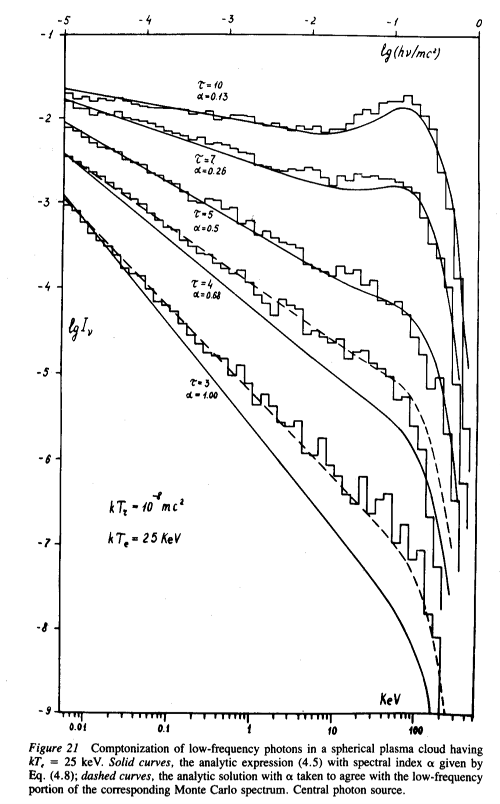
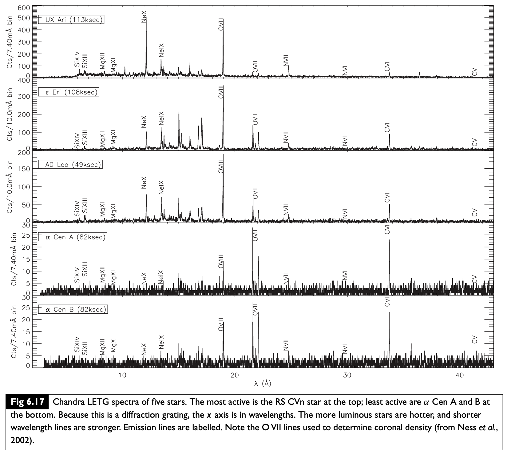
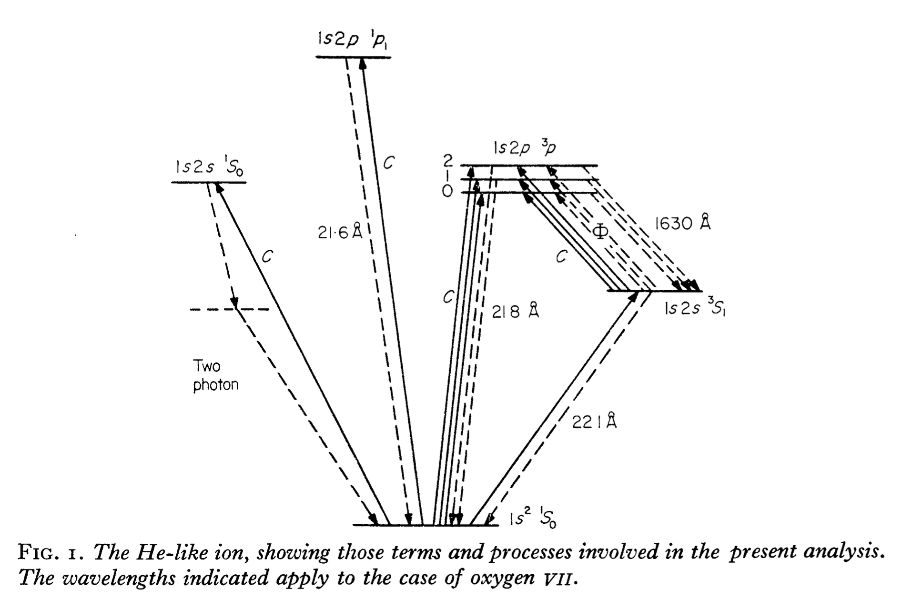
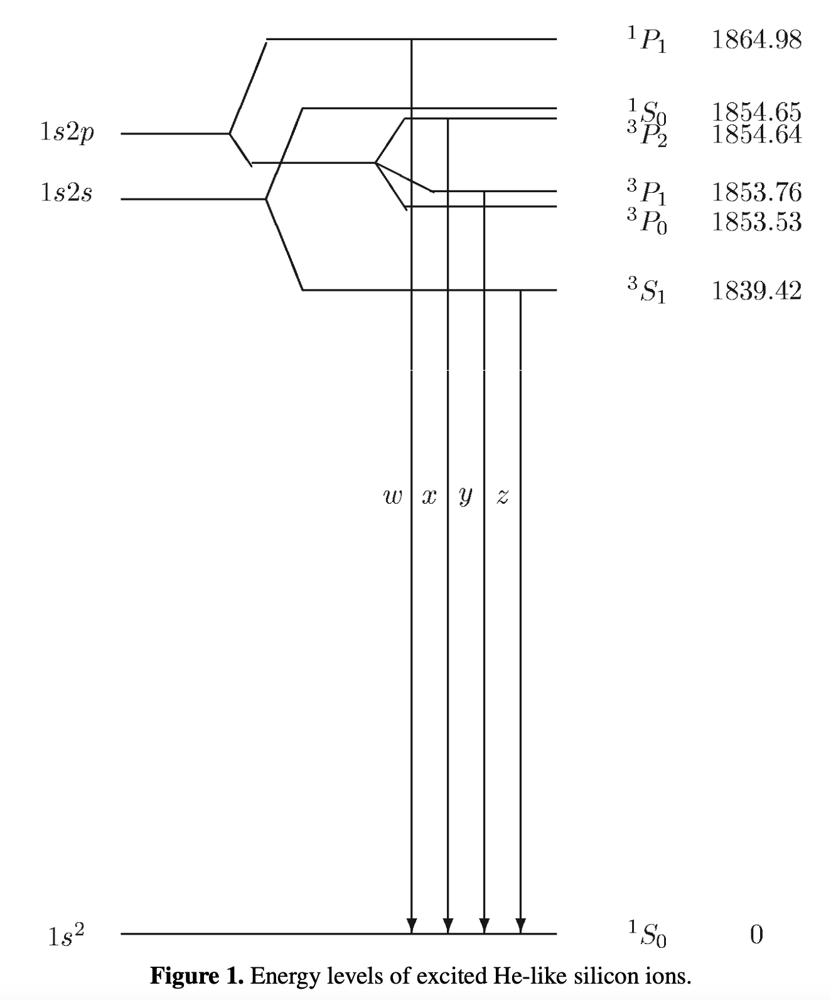
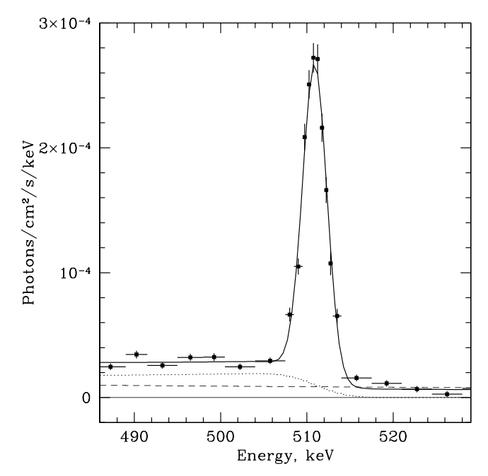

# Electromagnetic radiation mechanisms

These notes summarize important results for electromagnetic emission at high energies. The goal is to gain an overview of the different electromagnetic radiation mechanisms that are important in High Energy Astrophysics. Rather than look at the detailed derivation of each mechanism, we want to understand the general characteristics -- the photon spectrum, characteristic energies and other properties of the radiation, as well as what we can learn from the spectrum. If you want some more detail on the radiative processes, you could look at Rybicki \& Lightman (the classic book on this) or at my [notes for PHYS 642](https://www.physics.mcgill.ca/~cumming/teaching/642/phys642_all_notes.pdf). We'll split the processes into three groups - thermal radiation, non-thermal radiation, and spectral lines. 

## Thermal radiation

By thermal radiation, we mean radiation from gas in local thermodynamic equilibrium (LTE). LTE means that there is a well-defined temperature $T$ such that the velocities of the gas particles follow a Maxwell-Boltzmann distribution and the population of atomic levels follows a Boltzmann distribution $\propto e^{-E/k_BT}$ etc. There are two possibilities for the spectrum, depending on whether the gas is optically thick or optically thin.

### Planck spectrum from optically-thick gas

If the source is optically thick, photons interact many times with gas particles before leaving the source. The photon distribution then comes into thermal equilibrium at the same temperature as the gas. The spectrum is a blackbody or Planck spectrum:

$$
B_\nu(T)={2h\nu^3\over c^2}{1\over e^{h\nu/k_BT}-1}
$$

(units: $\mathrm{erg\ cm^{-2}\ s^{-1}\ Hz^{-1}\ sterad^{-1}}$).
Important limits are Rayleigh-Jeans at low frequency

$$
B_\nu={2\nu^2\over c^2}k_BT\propto \nu^2,
$$

and the Wien tail at high frequency

$$
B_\nu={2h\nu^3\over c^2}\exp\left({-h\nu\over k_BT}\right).
$$

The peak of $B_\nu$ is at $h\nu_{\rm max}=2.28 k_BT$ (the Wien displacement law), or $\nu_{\rm max}/T=5.88\times 10^{10}\ {\rm Hz\ K^{-1}}$. The peak of $B_\lambda$ is given by $\lambda_{\rm max}T=0.290\ {\rm cm\ K}$.

An important point is that the emission is a monotonically increasing function of temperature at all wavelengths, ie.

$$
\left.{\partial B_\nu(T)\over \partial T}\right|_\nu>0.
$$

While it might seem that going to a lower temperature would be the best way to make more low energy photons, in fact if we want more photons then we should go to higher temperature no matter what wavelength we are interested in.

Integrating over the spectrum ($F = 2\pi\int_0^1 d\mu\, \mu \int d\nu\, B_\nu$) gives the total flux

$$
F=\pi B={1\over 4}acT^4=\sigma_{SB}T^4
$$

where the Stefan-Boltzmann constant is $\sigma_{SB}=5.67\times 10^{-5}\ {\rm cgs}$ and the radiation constant is $a=7.5657\times 10^{-15}\ {\rm cgs}$.

It is important to note that although broadly similar to a Planck spectrum, stellar atmospheres usually show significant deviations, absorption lines being a common example. An important correction for neutron stars is the effect of scattering. In a scattering-dominated atmosphere, the photons are created at a thermalization depth which is significantly deeper than the photosphere, and they scatter multiple times before reaching the photosphere and escaping from the atmosphere. If $\ell_a$ is the absorption mean free path and $\ell_s$ is the scattering mean free path, you can show the thermalization depth is $\sqrt{\ell_a\ell_s}$ (the geometric mean of the two; the square root is because the scattering photons do a random walk). In this case, the spectrum is a "modified blackbody" $\sqrt{\epsilon_\nu}B_\nu$ where $\epsilon_\nu\approx \ell_s/\ell_a\ll 1$ is the probability of absorption (rather than scattering) at frequency~$\nu$ (see for example, Rybicki \& Lightman end of section 1.8). The emissivity is reduced because the photons we see were created in a depth $\sqrt{\ell_a\ell_s}<\ell_a$ rather than a depth $\ell_a$ for an atmosphere dominated by absorption opacity.


### Bremsstrahlung from optically-thin gas

In optically-thin gas, photons leave before interacting with the gas, so we see the radiation spectrum resulting from individual Coulomb scatterings of electrons with ions in the plasma. The radiation is very peaked in time, because the acceleration of the electron is much stronger when the electron is at its closest approach to the nucleus. The width of the pulse is $\sim b/v$, where $v$ is the particle velocity and $b$ is the impact parameter of the collision. **The spectrum is therefore very broad (narrow in time $\rightarrow$ broad in frequency space), but with a cutoff at high frequency.**

The total spectrum is obtained by integrating over impact parameters and particle velocities (Maxwell-Boltzmann distribution). The resulting emissivity as a function of frequency is 

$$
\epsilon_\nu^{ff}=6.8\times 10^{-38}\ {\rm erg\ s^{-1}\ cm^{-3}\ Hz^{-1}}\ Z^2n_en_iT^{-1/2}e^{-h\nu/k_BT}\bar{g}_{ff},
$$

where $\bar{g}_{ff}$ is the *thermally-averaged Gaunt factor* (typically of order unity). For $h\nu\ll k_BT$, the emissivity is independent of frequency ("flat spectrum") but decays rapidly as $e^{-h\nu/k_BT}$ at high frequencies. The spectrum is not completely flat at low frequencies, there is a small slope set by the frequency dependence of the Gaunt factor.

The total power per unit volume is $\int d\nu\, \epsilon^{ff}_\nu$, which gives 

$$
\epsilon^{ff}=1.4\times 10^{-27}\ {\rm erg\ s^{-1}\ cm^{-3}}\ T^{1/2}n_en_iZ^2\bar{g}_B,
$$

where $\bar{g}_B(T)$ is the thermally-averaged and frequency-averaged Gaunt factor.

A canonical example of thermal bremsstrahlung is X-ray emission from hot gas in Galaxy clusters. By measuring the cutoff in the X-ray spectrum as a function of the distance from the centre of the cluster, the temperature profile of the cluster can be determined.

A really important concept is the idea of **self-absorption**. For every emission process, there is a corresponding absorption process. For a thermal gas this is given by Kirchoff's law $j_\nu = \epsilon_\nu/4\pi  = \alpha_\nu B_\nu = \rho \kappa_\nu B_\nu$ which relates the emissivity $j_\nu$ to the absorption opacity $\kappa_\nu$. (The argument is that this relation must hold frequency-by-frequency so that in a blackbody enclosure the radiation is the same as the radiation emitted, maintaining equilibrium). In the case of Bremsstrahliung, the absorption process is called **free-free absorption**, with opacity $\kappa_{ff}\propto 1/\nu^2$. 
At low enough frequencies, the absorption opacity becomes large enough that the source is optically-thick to those photons, and so the spectrum is a Rayleigh Jeans spectrum $\propto \nu^2$ at the lowest frequencies.


## Non-thermal radiation

Here we are dealing with a population of electrons that do not have a well-defined temperature, i.e. they have an energy distribution which is not Maxwell-Boltzmann but something else. Often it is assumed that the energy distribution is a power law, 
$N(E)dE\propto E^{-p}dE$. We'll see later that particle acceleration mechanisms naturally lead to power law energy distributions.
 
### Synchrotron

Synchrotron radiation is from relativistic electrons moving in a magnetic field. The electrons orbit the magnetic field with the relativistic gyrofrequency $\omega_B = eB/\gamma m_ec$, but the emission is strongly beamed into a cone of opening angle $\sim 1/\gamma$, so it is like a lighthouse beam pointing in our line of sight for a short time each orbit. Added to this is the kinematic effect that the electron is moving almost at the same speed as the photons it emits, which further shortens the pulse. The radiation that we see is a very short pulse once an orbit with a duration $\sim 1/(\gamma^3\omega_B)$. 

The characteristic frequency of the radiation is 

$$
\omega_c={3\over 2}\gamma^3\omega_B= {3\over 2}\gamma^2 {eB\over m_ec}\rightarrow \nu_c=2.8\ \mathrm{MHz}\ \gamma^2\left({B\over \mathrm{G}}\right).
$$ 

Radiation from a single electron gives a broad spectrum $\propto \nu^{1/3}$ at low frequency, peaking at and falling off exponentially $\nu^{1/2}\exp(-\omega/\omega_c)$ at high frequency. 

For a power law distribution of electrons,

$$
\boxed{F_\nu\propto B^{(p+1)/2}\nu^{-(p-1)/2}}
$$

At low frequency, self-absorption becomes important as for Bremsstrahlung. There is a similar kind of argument to relate the absorption coefficient to the emissivity, except that we can't use Kirchoff's law $j_\nu=\alpha_\nu B_\nu$ because the electrons have a non-thermal distribution; instead the analysis starts with the Einstein coefficients (e.g. see Rybicki \& Lightman). The spectrum is 

$$
\boxed{F_\nu\propto \nu^{5/2}}
$$

at low frequency.


Important results are the power radiated per electron 

$$
P_S = {4\over 3}\gamma^2\beta^2 \sigma_T c {B^2\over 8\pi},
$$

and the associated "cooling time" 

$$
t_\mathrm{cool} = {\gamma m_e c^2\over P_S}=6\times 10^8\ {\rm s}\ B^{-2}\gamma^{-1}.
$$

Synchrotron radiation is strongly polarized. Linear polarization predominantly perpendicular to $\vec{B}$. Degree of polarization is $(P_\perp-P_\parallel)/(P_\perp+P_\parallel)=(p+1)/(p+7/3)$.

Minimum energy argument: you can show that for a collection of particles and fields radiating synchrotron at a certain observed luminosity, the minimum energy is when the energies of particles and fields are approximately equal (equipartition). 

The classic example is radio lobes where jets from AGN terminate. e.g. Cyg A radio galaxy. Size is about 50 kpc and total luminosity about $10^{45}\ \mathrm{erg\ s^{-1}}$ at radio frequencies of several GHz. Assume typical value $B\sim 10^{-4}\ {\rm G}$. With this $B$ we need $\gamma^2\sim 10^7$ to get a few GHz frequencies, or $\gamma\sim 3000$. Then the power radiated per electron is $\sim 10^{-16}\ \mathrm{erg\ s^{-1}}$, $\rightarrow 10^{61}$ electrons. Number density is then $10^{-8}\ \mathrm{cm}^{-3}$.
Cooling time is $\sim$ Myr, showing that energy input from the central black hole is needed to maintain the lobes.

### Inverse Compton scattering

In inverse Compton scattering, a photon scatters from a fast moving electron, gaining energy and increasing the photon frequency. This is calculated by boosting into the rest frame of the electron, then doing the scattering, and then boosting back to the lab frame again. The two Lorentz transformations introduce a factor of $\gamma$ each, giving a final photon energy $\sim \gamma^2$ times the initial photon energy.

The maximum photon energy after scattering is $\nu_f=4\gamma^2\nu_i$ (for a head-on collision). For a single electron, the photon number spectrum is flat with a cutoff at the maximum energy. The mean photon energy is $(4/3)\gamma^2$.

The electrons scattering the photons could have a thermal or non-thermal energy distribution. 
For a power law distribution of electron energies, the spectrum is $F_\nu\propto \nu^{-(p-1)/2}$ (same as synchrotron).

Compton scattering happens from many different types of sources. The cartoon on the next page is from Pozdnyakov, Sobol, and Sunyaev (1983) and shows some of the different sites.


The total power radiated is 

$$
P_C={4\over 3}\gamma^2\beta^2 \sigma_T c U_\gamma,
$$

which for thermal non-relativistic electrons gives 

$$
P_C={4k_BT\over m_ec^2}\sigma_T c U_\gamma.
$$

**Multiple scatterings**: often Compton scattering occurs in environments where multiple scatterings occur (i.e. optically thick to scattering). An important parameter is the **Compton $y$-parameter**, which measures whether the Compton scattering will significantly change the energy of the photon. For example, for a thermal gas of non-relativistic electrons, the number of scatterings is $\tau$ for $\tau\ll 1$ (optically thin) and $\tau^2$ for $\tau\gg 1$ (optically-thick), giving 

$$
y = {4k_BT\over m_ec^2}\mathrm{max}(\tau,\tau^2).
$$

**Comptonization**. For $y\gg 1$, the energies of the photons increase until recoil of the electrons becomes significant, and the spectrum evolves to an equilibrium. For the case where the gas has temperature $T$, the resulting spectrum is a **Bose-Einstein distribution** with a non-zero chemical potential $\mu$ set by the number of photons. (This thermalization process does not give a Planck spectrum because the number of photons is conserved in the scattering process; for a blackbody photons are created or destroyed as needed and $\mu=0$). I include a figure from Pozdnyakov, Sobol, and Sunyaev (1983) that shows the evolution of the spectrum as $y$ increases.

Multiple scatterings can also give rise to a power law spectrum of photons even when the electrons do not have a power law distribution of energies. Each scattering boosts the energy of the photon by a fixed amount, but each successive scattering has a smaller and smaller probability. The result can be a power law of photon energies, with higher energy photons resulting from a higher number of scatterings.

### Synchrotron self-Compton

If  we have a situation in which synchrotron photons are undergoing inverse Compton scattering, it can be possible for the power in inverse Compton to become comparable or try to exceed the synchrotron power supplying the seed photons. The ratio of powers is $P_C/P_S=U_\gamma/U_B$, the ratio of the photon and magnetic energy densities. The situation where $P_C$ exceeds $P_S$ is known as the "inverse Compton catastrophe", and corresponds to a brightness temperature of $10^{12}\ {\rm K}$ (e.g. Readhead 1994) above which synchrotron self-Compton can no longer be maintained.




## Line emission

Finally, discuss some of the ways to make spectral lines in X-rays and gamma-rays.


### Atomic lines in X-ray

We noted last time that the atomic energy scale moves into X-ray energies for atoms with enough protons. The example figure from p75 of Seward \& Charles shows some X-ray lines from Chandra obervations of stars. 



The H-like ionisation energy is $13.6\ \mathrm{eV}\ Z^2$, which is $0.49\ \mathrm{keV}$ for C, $0.87\ \mathrm{keV}$ for O, and $9.2\ \mathrm{keV}$ for Fe. The corresponding wavelength is $12.4 \mathring A\  (E_\gamma/1\ \mathrm{keV})^{-1}$.

### Ionization states

Astronomical notation for ionization states: for hydrogen, HI is neutral hydrogen, HII is singly-ionized hydrogen. This is extended to other elements. For example, OVIII is oxygen ionized 7 times, i.e. 1 electron, or H-like oxygen. 
The ionization state of each element depends on the temperature, there is a nice figure showing this from Seward and Charles book, p14:


### Some examples of lines

The OVIII K$\alpha$ transition (ie. the electron transitions from $n=1$ to $n=2$) has an energy $(3/4)\times 0.87\ \mathrm{keV}$, which gives $19\ \mathring A$, matching the wavelength of this line in the figure. 

He-like ions have triplets (resonance, intercombination, and forbidden lines). You can see this in the Chandra spectra, e.g. in the OXVII lines. Here are two examples of energy levels. The oxygen one is from Gabriel \& Jordan (1969), the silicon one is from Wang et al. (2012):




The resonance line corresponds to the $^1$P$_1\rightarrow ^1$S$_0$ transition which is an electric dipole transition (orbital angular momentum changes by one unit). The other transitions are not allowed by electric dipole and rely on higher order transitions. The forbidden transition is $^3$S$_1\rightarrow ^1$S$_0$. Collisions can promote an electron from the $^3$S$_1$ level to $^3$P$_1$ which can then decay to give the intercombination line. Because of this, the relative line strengths within the triplet can be used as a measure of density. 

An important emission line from black hole accretion disks is K$\alpha$. The line profile is used to constrain the spin of the black hole, since the emission at different wavelengths across the line profile encodes information about the temperature profile, Doppler shifting, and gravitational redshift in the disk. This line is a *fluorescence* line: X-ray photons from the central source photoionize iron atoms, removing an innermost K shell electron. An electron dropping from $n=2$ to $n=1$ then produces the K$\alpha$ photon. 


### Cyclotron lines

The motion of electrons spirally around magnetic field lines is quantized, with energy level (Landau level) spacing $\hbar\omega_c=\hbar eB/m_e c=11.6\ {\rm keV}\ (B/10^{12}\ \mathrm{G})$. In accreting neutron stars with magnetic fields this strong,  the accretion flow is channeled onto the magnetic poles of the neutron star giving rise to an accreting X-ray pulsar.

Cyclotron lines are often referred to as "Cyclotron resonance scattering features" (CRSFs). they arise when photons are scattered by electrons out of the line of sight. Gravitational redshift from the neutron star surface changes the line energy, and quantum effects can be important since $B$ is a significant fraction of $B_\mathrm{QED}=m_e^2c^3/(\hbar e)\approx 4.4\times 10^{13}\ \mathrm{G}$ (the magnetic field where the spacing between Landau levels is equal to the electron rest mass). See Coburn et al. (2006) for a review. Some sources show multiple harmonics. The energy of the observed line depends on the overall accretion rate of the source, which is telling us something about the geometry of the magnetic field and accretion column. 


### Electron-positron annhilation

If cold enough, electron-positron pairs form a bound state "positronium" (binding energy is a few eV). The singlet state (para-positronium) decays in 0.12 ns to two photons; the triplet state (ortho-positronium) has a longer lifetime (138.6 ns) and decays into 3 photons, so forms a continuum.

Churazov et al. (2005) reported a strong electron-positron annihilation line from the Galactic bulge seen with INTEGRAL. Here is their Fig. 1 showing the data and the fit with the line (singlet) and continuum (triplet) contributions:



The origin of the pairs is still not understood. Potential sources are radioactive elements from supernovae, pulsars or accreting black holes, or there could be some contribution from annihilation of dark matter particles. The overall annhilation rate is $\sim 10^{50}\ e^+\ \mathrm{yr^{-1}}$. See eg. Siegert et al. 2022 for a recent paper on this.

```{note}
Question to work on in class: You observe a source in the Galactic centre which has a luminosity approximately the Eddington luminosity for a solar mass. What is the flux received at Earth (in $\mathrm{erg\ cm^{-2}\ s^{-1}}$)? Assuming an average photon energy $\langle E_\gamma\rangle\sim 1\ \mathrm{keV}$, how many photons would you detect in a kilosecond with a detector with effective area $100\ \mathrm{cm^2}$? How far away could you move the source and still be able to detect it?
```
